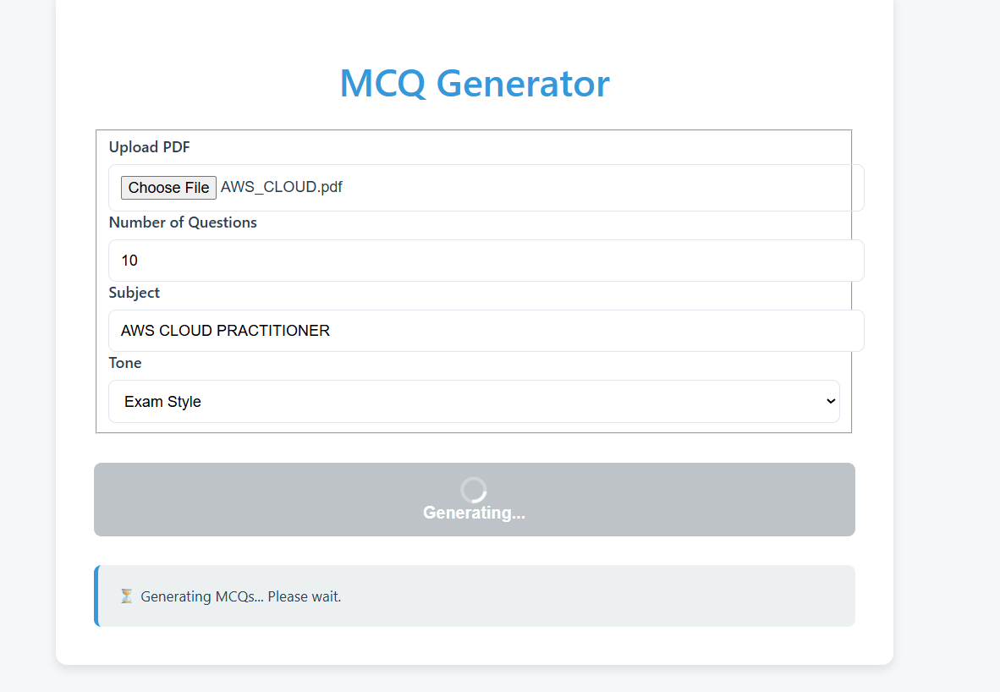
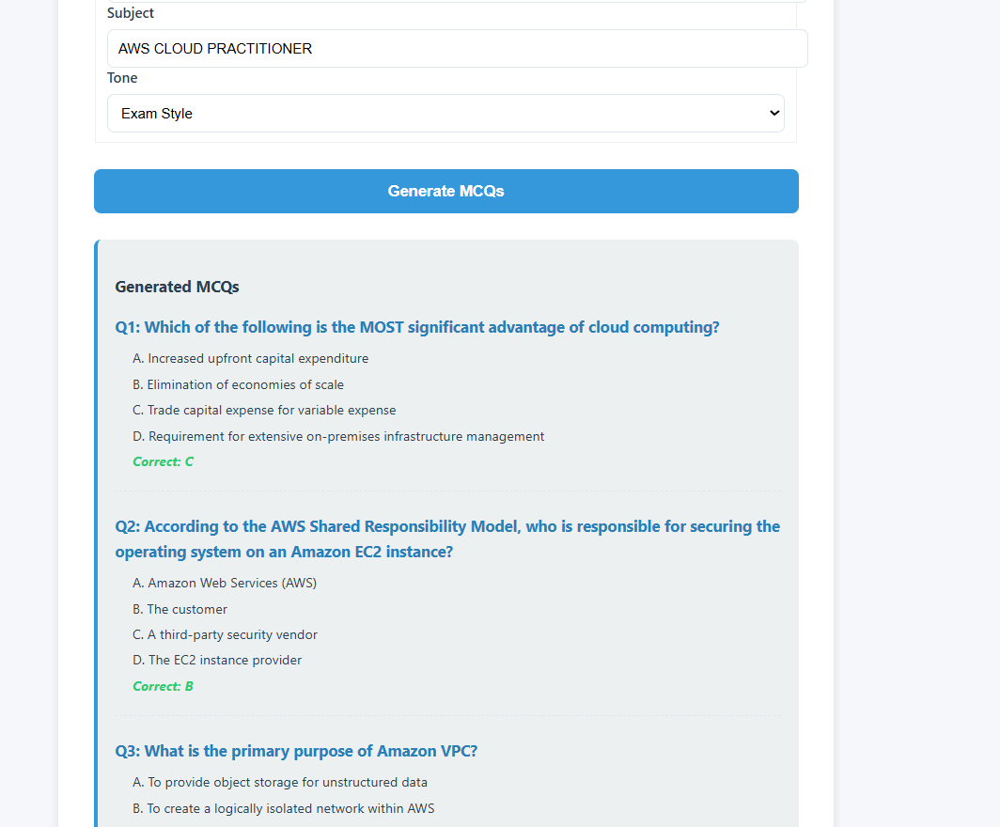
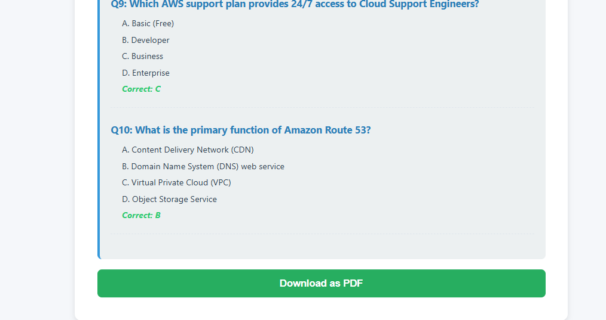
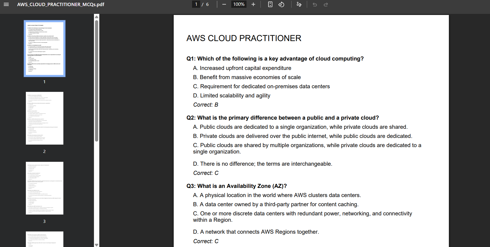

# MCQ Generator

A simple and powerful tool to generate multiple-choice questions (MCQs) from any PDF document.  
This project uses **FastAPI (Python)** as the backend with **LangChain + Gemini API** for intelligent MCQ generation, and a simple **HTML, CSS, and JavaScript** frontend for the user interface.  

---
## Screenshots






## Features
- 📄 **PDF Upload**: Easily upload your document in PDF format.  
- 🔢 **Customizable Quizzes**: Specify the number of questions, subject, and tone.  
- 📝 **Real-time Generation**: MCQs generated instantly using **LangChain + Gemini API**.  
- 💾 **Download as PDF**: Save the generated MCQs to a PDF file for offline use.  

---

## How it Works
1. **Frontend (HTML, CSS, JS)**  
   - Provides a simple UI to upload a PDF, enter quiz preferences, and view generated MCQs.  
   - Calls the backend API (`/generate_mcq/`) with form data.  
   - Renders MCQs on the page and allows downloading as PDF.  

2. **Backend (FastAPI + LangChain + Gemini API)**  
   - Extracts text from the uploaded PDF using **PyPDF2**.  
   - Uses **LangChain** with **Google Generative AI (Gemini)** to generate MCQs in strict JSON format.  
   - Sends back the generated quiz JSON to the frontend.  

3. **Download**  
   - The frontend uses **html2pdf.js** to save generated MCQs as a PDF.  

---

## Setup

### 1. Backend
- Clone the repository and navigate to `backend/`.  
- Install requirements:
  ```bash
  pip install fastapi uvicorn python-dotenv PyPDF2 langchain_google_genai

* Create a `.env` file with your **Gemini API key**:

  ```
  GEMINI_KEY=your_gemini_api_key_here
  ```
* Run FastAPI:

  ```bash
  uvicorn main:app --reload --host 0.0.0.0 --port 8000
  ```

### 2. Frontend

* Open `frontend/index.html` in your browser.
* Make sure the backend is running at `http://localhost:8000`.

---

## Demo

👉 A simple demo UI is included:

* `index.html` – upload form + quiz preview + download button
* `styles.css` – clean styling
* `script.js` – handles API requests + rendering + save-as-PDF

---

## Author

**Avijit Bhadra**

```

Do you also want me to **add a small diagram (flow: PDF → Backend → LangChain Gemini → JSON → Frontend → PDF download)** in the README so it looks more professional?
```
